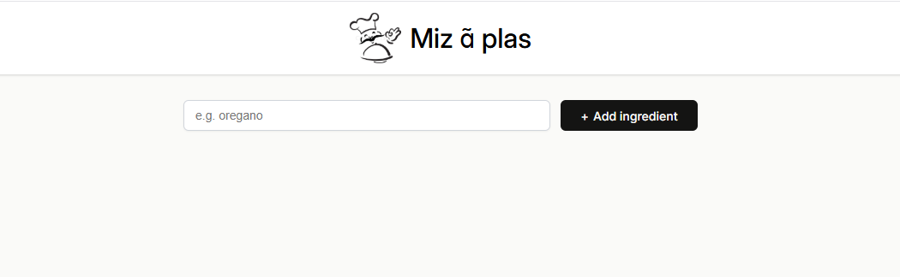
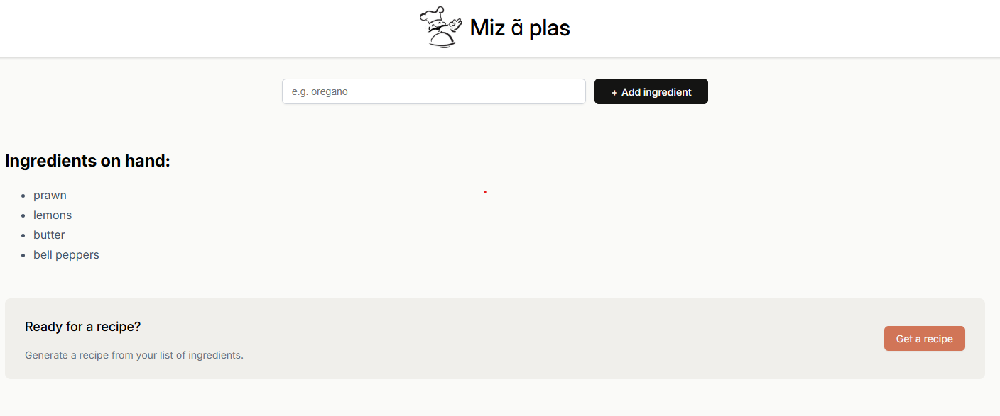
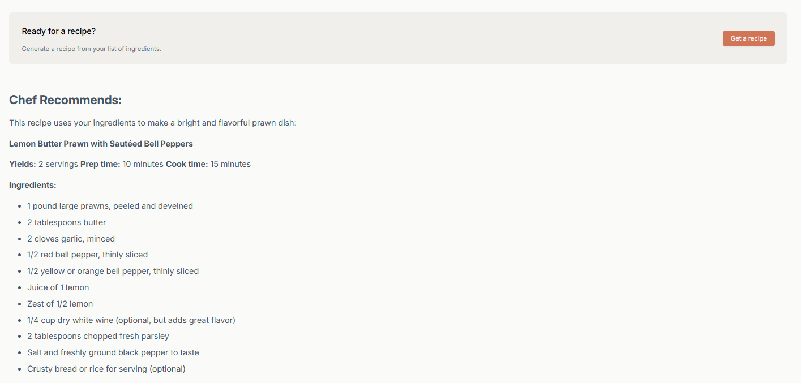
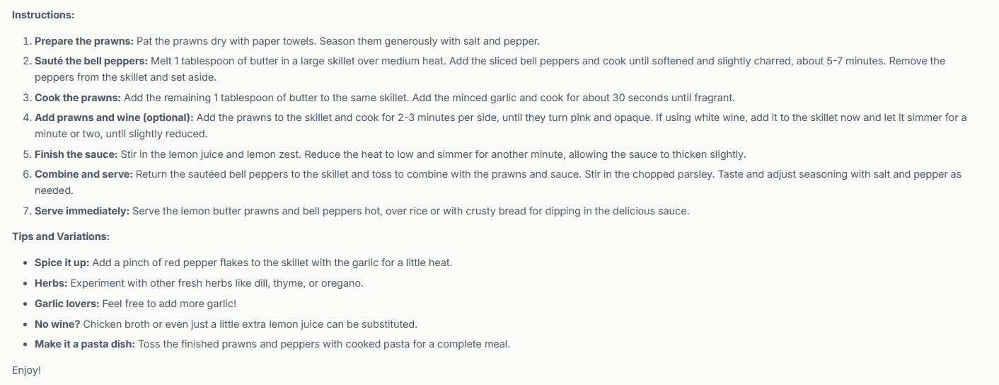

# Mis en place

This is a dynamic webApp built using the React ecosystem and powered by the Vite development server.

This app allows users to input at least four ingredients, and then, leveraging the power of the `gemini-1.5-pro` and `mistral-7b-instruct-v0.3` models, it generates a custom recipe tailored to the provided ingredients.

## To run locally 

1. clone the repository in your project folder ` https://github.com/liumOazed/mis-enplace-react.git`
2. Make sure you have local environment setup is ready for react if not then:
     - run `nvm install --lts`
     - `npm create vite@latest`
     - create your project folder
     - run `npm install`
  
3. Once the environment is ready just run `npm run dev`
4. Check the other dependencies required for accessing `huggingface-api` and `gemini-api` from `requirements.txt`

## Screenshot 1

## Screenshot 2

## Screenshot 3

## Screenshot 4

